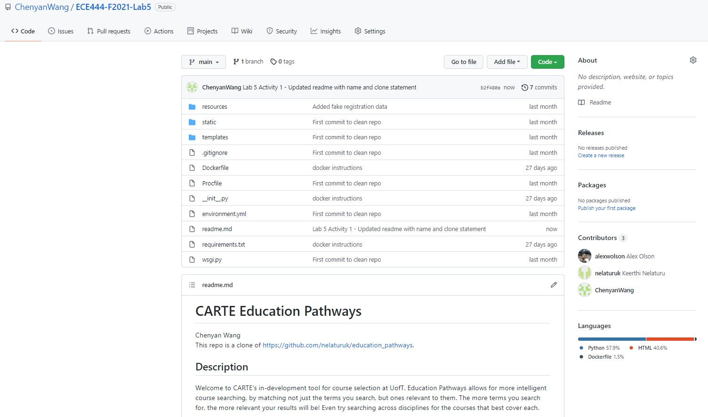

# CARTE Education Pathways
Chenyan Wang  
This repo is a clone of https://github.com/nelaturuk/education_pathways.  

## Activity 1  
Screenshot of repo after clone and updated readme.  
  

## Description
Welcome to CARTE's in-development tool for course selection at UofT. Education Pathways allows for more intelligent course searching, by matching not just the terms you search, but ones relevant to them. The more terms you search for, the more relevant your results will be! Even try searching across disciplines for the courses that best cover each.

Whatever year you are looking for, Education Pathways will also suggest courses in earlier years that will best help you to prepare. To get the most out of this, try searching for courses in a later year and see what is suggested for your current one.

We are looking for feedback to improve Education Pathways and make it more useful for students. If you have ideas or suggestions, please email us!

## Setup Instructions

### Notes for Setup on Windows  
To run this repo, need to install python 3.8 and add it to your path.  

Create the virtual environment and activate:   
virtualenv venv  
.\venv\Scripts\activate  

Install flask and dependencies for repo:  
pip install flask  
pip install flask-script  
pip install flask-bootstrap  
pip install flask-moment  
py -3.8 -m pip install -r .\requirements.txt  

If any messages appear saying "WARNING: The script flask.exe is installed in '<location>' which is not on PATH.
  Consider adding this directory to PATH or, if you prefer to suppress this warning, use --no-warn-script-location.", add the location to your path.  

Run the app:  
py -3.8 -m flask run  

### With Docker

## Repository files:

`./Procfile ./wsgi.py` *tells gunicorn how to run the program*

`./environment.yml  ./requirements.txt` *specifies python requirements for anaconda and pip respectively*

`./__init__.py` *main flask code*

`./readme.md` *this file*

`./resources:` *contains datasets used in the program*

`course_vectorizer.pickle df_processed.pickle`

`course_vectors.npz       graph.pickle`

`./static:` *contains any static elements of the webpage, in this case just the CARTE logo*
`CARTE_logo.jpg`

`./templates:` *contains flask templates for rendering HTML*

`_formhelpers.html course.html       index.html        results.html`
